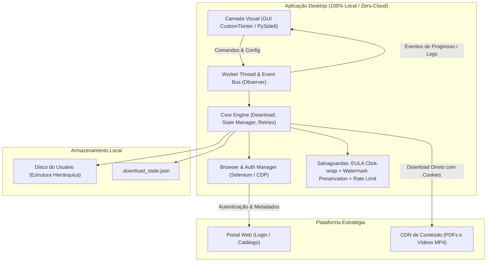
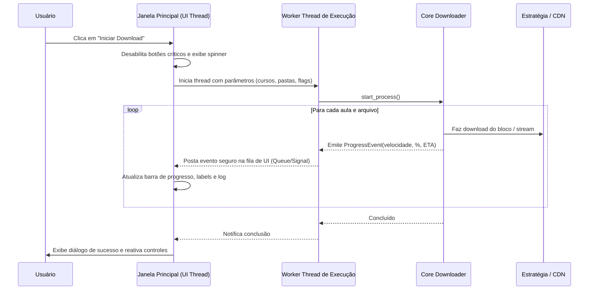

# Plano de Engenharia e Blindagem: Produtização, Interface Gráfica (GUI) e Proteção Legal

Este documento estabelece o plano completo para transformar o utilitário de download em um produto desktop robusto, intuitivo e com salvaguardas legais e técnicas sólidas contra usos irregulares e violações de direitos autorais.

---

## 1. Visão Geral e Objetivos

O projeto atual é um script Python monolítico baseado em Selenium, Requests e Rich (CLI), focado no download resiliente e estruturado de materiais de estudo da plataforma Estratégia Concursos.

A transição para um **produto acabado** envolve três pilares interconectados:
1. **Produtização e Empacotamento:** Desacoplar a lógica de negócio da CLI, gerenciar browsers de forma transparente e distribuir como executável autônomo (*zero-setup* para o usuário final).
2. **Interface Gráfica (GUI):** Construir uma aplicação desktop moderna, reativa e não-bloqueante, com seleção granular de cursos/disciplinas, visualização de progresso e gerenciamento de configurações.
3. **Blindagem Jurídica e Operacional:** Adotar arquitetura *client-side only*, termos de uso vinculantes (*click-wrap*), preservação intocada de marcas d'água (watermarks/CPF) e desacoplamento de marca para mitigar riscos de responsabilidade civil e criminal (Lei 9.610/98, Marco Civil da Internet e Código Penal).



---

## 2. Eixo 1: Produtização e Arquitetura do Software

### 2.1. Desacoplamento da Lógica Monolítica
Atualmente, `main.py` acumula parsing de argumentos CLI, inicialização do navegador Edge, scraping do DOM, requisições HTTP e impressão no console via Rich.

Para viabilizar uma GUI e manter a CLI funcionando, a arquitetura deve ser refatorada no padrão **MVC / Clean Architecture**:

```
AutoDownloadEstrategia/
│
├── core/
│   ├── __init__.py
│   ├── config.py             # Configurações globais, paths padrão no sistema (AppData / .config)
│   ├── session.py            # Sessão HTTP resiliente com retries e Keep-Alive
│   ├── state_manager.py      # Persistência de progresso e Smart Resume
│   ├── crawler.py            # Navegação no site e extração de cursos/disciplinas/aulas
│   ├── downloader.py         # Download atômico em chunks (.part -> final) com throttling
│   └── events.py             # Eventos e interface abstrata de Observer/Callbacks
│
├── browser/
│   ├── __init__.py
│   └── driver_manager.py     # Detecção automática de navegadores (Chrome, Edge, Firefox)
│
├── legal/
│   ├── __init__.py
│   ├── eula_text.py          # Termos de Uso e Isenção de Responsabilidade
│   └── license_verifier.py   # Verificação de aceite de termos e proteções locais
│
├── ui/
│   ├── cli/                  # Implementação CLI atual (Rich) como observadora de eventos
│   │   └── rich_ui.py
│   └── gui/                  # Nova Interface Gráfica Desktop
│       ├── app.py            # Janela principal e ciclo de vida
│       ├── views/            # Telas: Login, Seleção de Cursos, Progresso, Configurações
│       └── workers.py        # QThread / threading.Thread para execução assíncrona
│
├── main.py                   # Ponto de entrada inteligente (inicia GUI por padrão, CLI via flag --cli)
└── requirements.txt
```

### 2.2. Sistema de Eventos (Observer Pattern)
O `downloader` e o `crawler` emitirão eventos tipados que podem ser consumidos tanto pela interface gráfica quanto pelo console:

```python
from dataclasses import dataclass
from typing import Optional, Callable

@dataclass
class ProgressEvent:
    filename: str
    downloaded_bytes: int
    total_bytes: Optional[int]
    speed_bytes_sec: float
    eta_seconds: Optional[float]
    percent: float

@dataclass
class StatusEvent:
    level: str  # 'info', 'warning', 'error', 'success'
    message: str
    course_name: Optional[str] = None
    lesson_name: Optional[str] = None

class DownloadObserver:
    def on_progress(self, event: ProgressEvent) -> None: pass
    def on_status(self, event: StatusEvent) -> None: pass
    def on_item_completed(self, item_name: str, item_type: str) -> None: pass
    def on_finished(self, summary: dict) -> None: pass
```

### 2.3. Multi-Browser e Resiliência de WebDriver
Atualmente, o script fixa `webdriver.Edge()`. Para usuários de Linux, macOS ou Windows sem Edge:
- Usar o **Selenium Manager** (nativo do Selenium 4.20+) com fallback em cascata: Edge -> Chrome -> Chromium -> Firefox.
- Possibilidade de suporte a modo *Headless* (sem tela) após a autenticação inicial ter sido salva em cookies de sessão.

### 2.4. Empacotamento Desktop (Standalone Executable)
O usuário comum não tem Python instalado. O processo de distribuição requer:
- **PyInstaller** ou **Nuitka**:
  - Geração de binário único (`.exe` no Windows, `.bin`/AppImage no Linux).
  - Flags de compilação sem janela de console (`--noconsole` ou `--windowed`) para a versão com GUI.
  - Inclusão automática de assets (ícones, temas, arquivos estáticos de licença).
- **Armazenamento de Configurações no Padrão do SO**:
  - Em vez de gravar em diretórios hardcoded (`E:/Estrategia`), utilizar paths canônicos:
    - Windows: `%LOCALAPPDATA%\AutoEstudo\`
    - Linux: `~/.config/autoestudo/`
    - macOS: `~/Library/Application Support/AutoEstudo/`

---

## 3. Eixo 2: Implementação da Interface Gráfica (GUI)

### 3.1. Comparativo de Frameworks Desktop

| Critério | CustomTkinter | PySide6 (Qt) | Flet (Flutter) |
|---|---|---|---|
| **Aparência** | Moderna (Dark/Light nativo) | Altamente customizável, profissional | Estilo Web/Material/App móvel |
| **Peso do Executável** | Leve (~25 - 35 MB) | Médio-Pesado (~70 - 110 MB) | Pesado (~90 - 140 MB) |
| **Complexidade de Código** | Baixa a Média (Python puro) | Média (Signals/Slots, MVC complexo) | Média (paradigma reativo) |
| **Licenciamento** | MIT (Permissivo total) | LGPLv3 (Requer cuidados de linkage dinâmico) | Apache 2.0 |
| **Facilidade de Empacotamento** | Excelente com PyInstaller | Boa, mas exige hooks de plugins Qt | Múltiplos binários/processos |

> **Decisão Aprovada:** **CustomTkinter** como framework oficial da interface desktop pelo visual moderno em Dark Mode, licença MIT sem riscos jurídicos de linkage e binário final leve.

### 3.2. Arquitetura Não-Bloqueante (Concorrência na GUI)
Em aplicações desktop, nunca se deve executar automação de navegador ou downloads de rede na thread da interface gráfica (UI Thread), sob pena de congelar o programa e gerar mensagem de "Não está respondendo".



### 3.3. Telas e Wireframe Conceitual da Interface

A GUI será organizada em 4 abas ou etapas visuais:

1. **Aba 1: Autenticação & Sessão:**
   - Opção A: Inserção de credenciais locais (armazenadas com segurança via `keyring` do SO, nunca em texto puro).
   - Opção B: Botão *"Abrir Navegador para Conectar"* — abre a janela de login e captura a sessão autenticada assim que o usuário faz login (lidando naturalmente com 2FA e eventuais CAPTCHAs).
   - Status da conexão: Badge visual (`🟢 Sessão Ativa: Nome do Aluno` ou `🔴 Desconectado`).

2. **Aba 2: Seleção de Conteúdo:**
   - Modo Pacote/Curso via link/ID: Campo de texto com validação em tempo real.
   - Modo "Minhas Matrículas": Lista carregada dinamicamente com checkbox em cada curso.
   - Seletor de disciplinas e aulas com opção *"Selecionar Tudo"* / *"Desmarcar Concluídos"*.

3. **Aba 3: Configurações de Download:**
   - Pasta de Destino: Seletor de diretório nativo (`Browse...`).
   - Switch: *Baixar Videoaulas (.mp4)* [Ativado / Desativado].
   - Dropdown de Resolução: `720p (Padrão)`, `480p (Econômico)`, `360p (Baixo Consumo)`.
   - Switch: *Smart Resume Ativo* (Pular aulas já concluídas).
   - Limite de taxa (Rate Limit) para não saturar a internet do usuário.

4. **Aba 4: Central de Downloads e Progresso:**
   - Barra de progresso geral (porcentagem total do curso/pacote).
   - Barra de progresso do arquivo atual com velocidade em tempo real (`ex: 4.8 MB/s`) e ETA restante.
   - Console de log limpo e estilizado, com filtros por gravidade (Erros, Avisos, Sucessos).
   - Botões de controle: *Pausar*, *Retomar*, *Cancelar Download*.

---

## 4. Eixo 3: Blindagem Jurídica, Ética e Técnica

A questão do download de materiais educacionais envolve propriedade intelectual protegida pela **Lei de Direitos Autorais (Lei nº 9.610/98)**, pelo **Marco Civil da Internet (Lei nº 12.965/14)** e pelo **Código Penal Brasileiro (Art. 184)**. 

Para resguardar integralmente o desenvolvedor/distribuidor do software contra acusações de favorecimento à pirataria ou cumplicidade em compartilhamento irregular, devem ser adotadas as seguintes camadas de blindagem:

### 4.1. Princípio da Neutralidade Tecnológica e "Dual-Use" (Doutrina Sony Betamax)
- O software deve ser estritamente caracterizado como **ferramenta de automação de acesso pessoal e cópia de segurança (backup offline)**, amparada nos limites do uso privado (interpretação análoga ao Art. 46, II da Lei 9.610/98 para estudo particular sem finalidade lucrativa).
- Assim como navegadores, gerenciadores de download (IDM, JDownloader, curl, yt-dlp) ou gravadores de mídia possuem finalidade legítima de cópia pessoal, o autor da ferramenta não é responsável pelo uso ilícito feito por terceiros que eventualmente redistribuam o material.

### 4.2. Arquitetura 100% Client-Side (Zero-Cloud / Zero-Central-Server)
- **Nenhum servidor intermediário:** A ferramenta não deve possuir backend próprio, banco de dados na nuvem, proxies ou servidores de retransmissão de arquivos.
- **Toda comunicação é ponto a ponto direta** entre o computador do usuário e os servidores oficiais do provedor de conteúdo.
- **Zero armazenamento de credenciais externas:** Nenhuma senha, token ou cookie de usuário é enviado para o desenvolvedor ou servidores externos. Isso elimina qualquer passivo sob a **LGPD (Lei nº 13.709/18)**.

### 4.3. Preservação Intocada das Marcas D'água (Digital Watermarking)
> **A mais poderosa salvaguarda técnica do projeto:**
> A plataforma Estratégia Concursos injeta marcas d'água dinâmicas contendo o **Nome, CPF e e-mail** do contratante em todas as páginas dos arquivos PDF e nos metadados/frames dos vídeos.
> - O utilitário **JAMAIS** deve implementar qualquer mecanismo de remoção, ofuscação, corte de rodapé ou higienização de marcas d'água.
> - Ao manter os arquivos 100% originais com a marca d'água do titular da conta: se um usuário mal-intencionado baixar o material e vazá-lo em grupos de Telegram, fóruns de rateio ou torrents, **o departamento jurídico da plataforma identificará e processará diretamente o portador do CPF estampado no documento**, comprovando que a infração foi cometida por aquele assinante específico, e não pela existência do software.

### 4.4. Termo de Responsabilidade Vinculante (Click-Wrap EULA no Primeiro Boot)
Na primeira execução da GUI (e no modo CLI via prompt interativo), o aplicativo exibirá obrigatoriamente uma janela modal de Termos de Uso que deve ser aceita antes de liberar qualquer funcionalidade:
- **Declaração de Legitimidade:** O usuário declara expressamente que é assinante legítimo do serviço e que possui direito de acesso aos materiais selecionados.
- **Finalidade Exclusivamente Pessoal:** O usuário compromete-se a utilizar os downloads unicamente para seu próprio estudo pessoal, em observância ao contrato assinado com a plataforma.
- **Proibição Estrita de Redistribuição:** O usuário é explicitamente alertado de que o compartilhamento, venda, doação, upload em nuvens públicas ou rateio do material constitui violação contratual e crime previsto no Art. 184 do Código Penal.
- **Isenção Total do Desenvolvedor:** Cláusula de limitação de responsabilidade deixando claro que o software é fornecido *"no estado em que se encontra"* (AS IS), sem garantias de qualquer natureza, sendo o usuário o único e exclusivo responsável cível e criminal pelo destino dado aos arquivos baixados.
- O aceite é registrado localmente com timestamp em arquivo de configuração cifrado/assinado ou em hash de integridade.

### 4.5. "Good Citizen" Scraping e Rate Limiting (Proteção contra Art. 154-A do CP)
Downloads acelerados e requisições concorrentes massivas poderiam ser enquadrados por operadoras de cursos como tentativa de indisponibilizar servidores ou exploração abusiva de infraestrutura:
- Implementar **pausas humanas (jitter)** entre requisições de páginas.
- Baixar arquivos sequencialmente ou com concorrência estritamente limitada (máximo de 2 conexões simultâneas).
- Respeitar códigos HTTP de resposta (`429 Too Many Requests`), acionando backoff exponencial automático.

### 4.6. Desassociação de Marca e Propriedade Intelectual
- O aplicativo não deve usar logotipos oficiais, identidade visual proprietária ou alegar qualquer endosso da empresa Estratégia Concursos.
- Usar nome de produto neutro, por exemplo: `CorujaSync - Backup Inteligente de Estudos`.
- Inserir aviso de isenção (*disclaimer*) visível no rodapé da GUI e no README:
  > *"Este software é um utilitário independente e de código aberto para backup de estudos pessoais. Não é patrocinado, afiliado nem aprovado pela empresa Estratégia Concursos ou qualquer outra entidade de ensino."*

---

## 5. Plano de Execução Proposto

### Detalhamento das Etapas:

#### Fase 1: Desacoplamento do Core e Sistema de Eventos
- Criar a pasta `core/` e isolar `crawler.py`, `downloader.py` e `events.py`.
- Transformar `DownloadUI` existente em uma implementação de `DownloadObserver`.
- Garantir que todos os 12 testes unitários atuais continuem passando sem regressões.

#### Fase 2: Implementação dos Mecanismos de Proteção Legal
- Criar módulo `legal/` com o texto integral do EULA em português claro e objetivo.
- Adicionar validação de aceite prévio no primeiro boot (armazenado em `~/.config/` ou `%LOCALAPPDATA%`).
- Garantir que nenhum arquivo baixado passe por filtros de remoção de metadados.

#### Fase 3: Construção da Interface Gráfica (CustomTkinter)
- Desenvolver a janela principal com navegação por abas ou painel lateral (Sidebar).
- Implementar o `WorkerThread` usando fila segura (`queue.Queue`) para alimentar a GUI com taxas de transferência, ETA e logs.
- Criar diálogo de autenticação integrado (permitindo login automático ou abertura assistida de navegador).

#### Fase 4: Pipeline de Empacotamento Desktop
- Escrever arquivo de especificação do PyInstaller (`build.spec`) configurado para criar binário executável individual.
- Incluir script de build automatizado para empacotar em Windows e Linux.

---

## 6. Plano de Verificação e Testes

### 6.1. Testes Automatizados
- **Testes Unitários:**
  - `test_events.py`: Validar se o `DownloadObserver` recebe todos os eventos de progresso, conclusão e erro corretamente.
  - `test_eula.py`: Validar que o fluxo de execução é bloqueado se o EULA não for aceito e liberado quando aceito.
  - `test_downloader_throttling.py`: Validar que o downloader respeita pausas e não gera sobrecarga indevida.
- **Suíte Existente:**
  - Manter a execução de `python -m unittest discover -v` com 100% de aprovação.

### 6.2. Testes Manuais de Usabilidade e GUI
1. **Primeira Inicialização:** Abrir o executável em máquina limpa (sem Python). Verificar se o modal de Termos de Uso é exibido e se o botão de prosseguir só é liberado após rolagem ou aceite expresso.
2. **Fluxo de Autenticação:** Testar login automático e login assistido (abrindo navegador externo e capturando cookies).
3. **Download com Progresso Real:** Iniciar download de aula com vídeo e verificar se a barra de progresso avança fluidamente sem congelar ou travar a janela da aplicação.
4. **Validação de Arquivo:** Abrir o PDF baixado e confirmar que a marca d'água com nome e CPF do assinante está intacta e legível.
